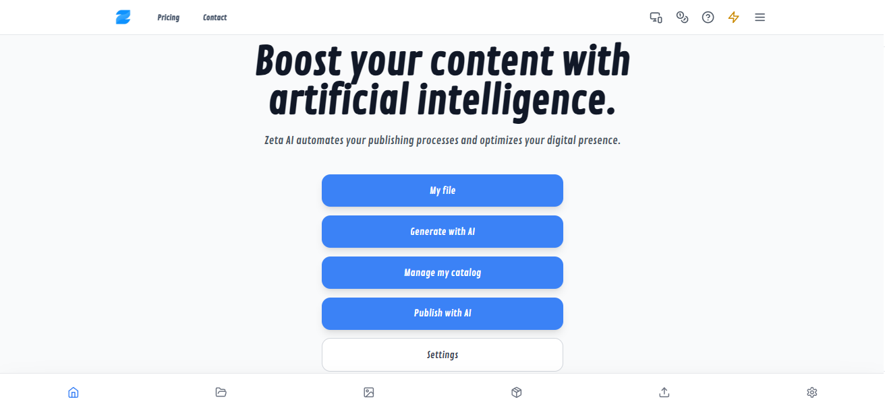
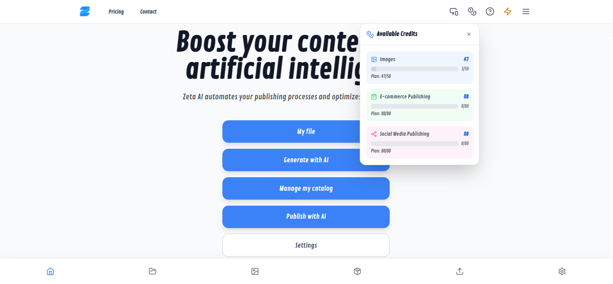

# zeta-ai-public-overview
Scalable AI-powered SaaS platform with multi-user architecture, credit-based usage control, and business automation workflows.
# Zeta AI – AI-Powered SaaS Platform

Production-ready AI SaaS platform designed for stock management, e-commerce operations, and automated social media workflows.

---

## 🚀 Overview

Zeta AI is a scalable multi-user SaaS platform currently running in production.  
It integrates authentication systems, credit-based usage control, AI APIs, and automation workflows to support business operations.

The platform is designed with cost-efficiency, scalability, and production stability as core principles.

---

## 🧠 Core Capabilities

- Multi-user authentication (Email/Password + OAuth + Account Linking)
- Credit-based usage control system
- AI API integrations for automated content and media processing
- Business workflow automation for stock and e-commerce management
- Structured Firestore database designed for scalable environments
- Production deployment and continuous optimization

---

## 🏗 System Architecture

High-level architecture flow:

Client (Frontend)  
→ Firebase Authentication  
→ Firestore Database  
→ Cloud Functions  
→ External AI APIs  
→ Cloud Storage  

The system ensures controlled AI consumption, atomic credit updates, and secure multi-user data separation.

*(Architecture diagram available in /docs folder)*

---

## 💳 Credit-Based Usage Model

- Users consume credits per AI-driven operation  
- Credit validation occurs before API execution  
- Usage updates are handled atomically in Firestore  
- Designed to prevent cost overrun and ensure predictable API expenses  

This model enables controlled scalability while maintaining operational efficiency.

---

## 🔐 Authentication Structure

- Email/Password authentication  
- OAuth provider integration  
- Account linking support  
- Multi-user data segmentation  
- Secure session handling  

---

## 📊 Production Context

Zeta AI is deployed in a live environment and actively maintained.  
The system architecture prioritizes:

- Stability under multi-user load  
- Cost-aware API consumption  
- Modular integration patterns  
- Clean separation between authentication, logic, and external services  

---

## 📸 Interface Preview

---

## ⚠️ Public Repository Notice

This repository provides a high-level architectural overview of the platform.  

Sensitive business logic, proprietary workflows, and internal optimization strategies are intentionally excluded.

The purpose of this repository is to demonstrate architectural design, system thinking, and production-level SaaS structuring.
